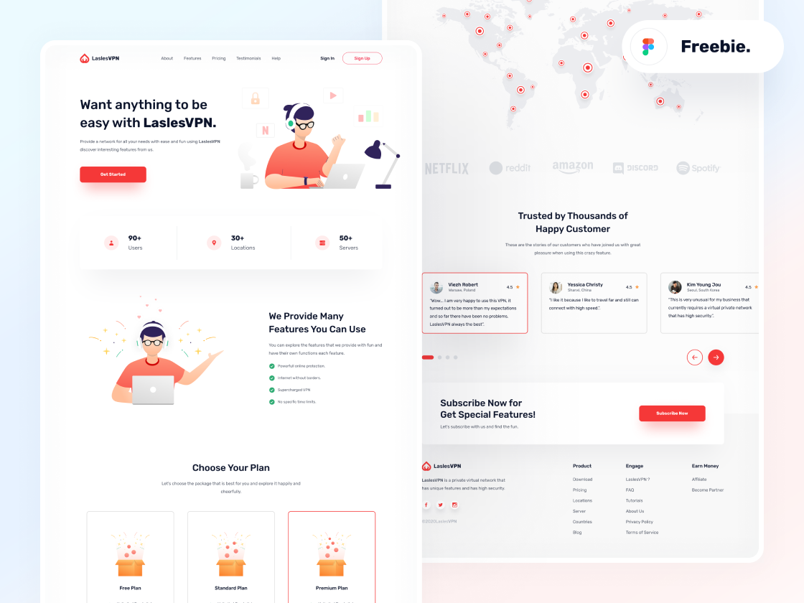

# Transforming Figma Designs into Clean, Valid, and Responsive HTML/CS
* HTML
* CSS
## [Figma design files into HTML code - Demo](https://figma-to-html-css-laslesvpn.netlify.app/)
## [Figma design ](https://www.figma.com/file/J7IbKtPFzinLLqRnzJTF7g/FREEBIES-Landingpage-LaslesVPN-(Community)?type=design&node-id=14%3A3&mode=design&t=nzpcXGiXJNbyKM2m-1)
##

###
### I am processing Figma design layouts and transforming them into live and functional web code.
###

* Figma to HTML/CSS Conversion.
* Clean and well-structured HTML and CSS code.
* High-Quality Results
* Validity and Accessibility
* Responsive Design
